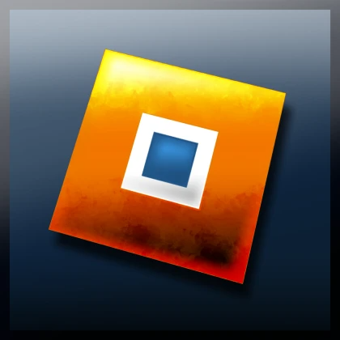

# Staticaliza's Blender Animation Tools for Roblox

  

One Blender extension provides three focused N-panels:

- **Roblox Animator** — Cautioned's importer, rigging, animation, and export workflow.
- **Roblox Animator Utils** — Staticaliza's animation, contact-pin, ragdoll, camera, onion-skin, and rig utilities.
- **Roblox Animator Impact** — Staticaliza's anime impact-frame authoring and preview renderer.

Blender Preferences shows one entry, **Staticaliza's Blender Animation Tools**. Its lightweight host downloads Roblox Animator, Utils, and Impact as private runtimes and retains three separate N-panel tabs.

The complete toolset supports **Blender 4.2 through Blender 5.2**. Most animation tools are intended for Pose Mode.

## Current Versions

- **Roblox Animator Utils:** 1.7.0
- **Roblox Animator Impact:** 1.0.0
- **Extension Setup:** 1.0.0

The setup downloads the latest Roblox Animator release and the latest Utils and Impact packages from this repository's `src/`, then registers them in that order.

## Installation

1. Download `staticaliza_blender_animation_tools.zip` from the [latest GitHub release](https://github.com/Staticaliza/Staticaliza-Blender-Animation-Tools/releases/latest).
2. In Blender, open **Edit > Preferences > Get Extensions**.
3. Choose **Install from Disk** and select the ZIP.
4. Enable **Staticaliza's Blender Animation Tools** and allow online access. The lightweight host downloads and privately loads all three tools; no child extensions need to be installed separately.

To update later, open **Roblox Animator Utils > Extension** and choose the update action. It downloads and hot-loads the latest versions of all three private runtimes; Impact has no separate in-panel updater.

The **Install Roblox Plugins** button opens the recommended [Roblox Blender Animation Tools](https://create.roblox.com/store/asset/118148792788940) and [**Blender Animations (ultimate edition)**](https://create.roblox.com/store/asset/16708835782/Blender-Animations-ultimate-edition).

## Features

- **Animation Tools**: Dynamic Parent, Dynamic Unparent, Surface Contact, and ragdoll workflows.
- **Armature Tools**: Work with multiple rigs in Pose Mode while inactive rigs stay visually separated, and remove imported rigs with one undoable cleanup action that preserves shared assets.
- **Onion Tools**: Preview meshes and bones with selectable Onion Pins, Contact targets, and snap rings.
- **Camera Tools**: Attach adjustable-FOV cameras to selected bones, keyframe camera views, switch bone/object pivots, and use Smart Draggers for guided transforms.
- **Impact Tools**: Author and preview impact-frame looks in the dedicated Roblox Animator Impact N-panel.

## Shortcuts

| Shortcut | Action |
| --- | --- |
| `Tab` | Toggle animation loop |
| `F` | Toggle Onion Skin |
| `Shift + F` | Create or manage Onion Pins |
| `Ctrl + F` | Open Animation Tools |
| `Y` | Switch Global/Local orientation |
| `Shift + Y` | Switch Bone/Object pivot |

## Author

This project and its releases are authored by **Staticaliza**.

## Credits

- [Cautioned/Blender-Animations-Plugin](https://github.com/Cautioned/Blender-Animations-Plugin)
- **Dynamic Parent 2.0.2**, updated for Blender 4.2 through 5.2 and Roblox animation export.

## License

Roblox Animator Utils and Roblox Animator Impact are distributed under the GNU General Public License v2.0 or later.
